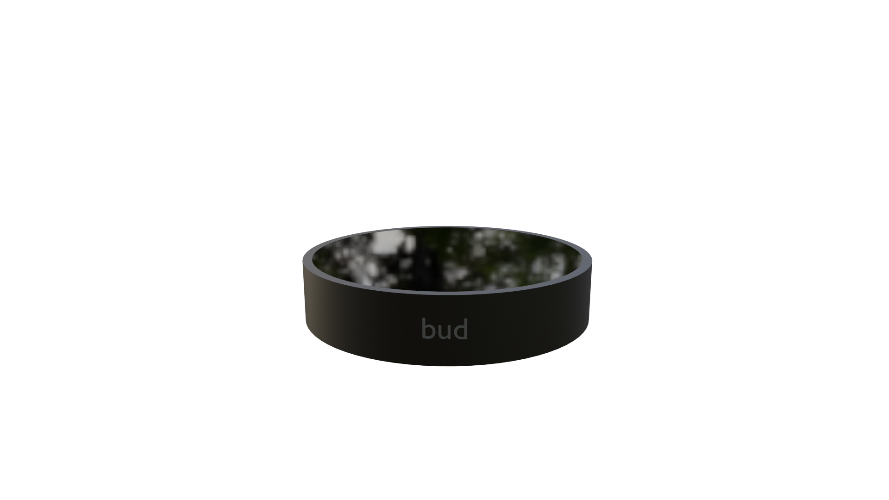

This just the first draft, I've made it in Blender in less than a hour

Might not be the best piece of hardware/software in the world, but it will work!

Table of contents
=======================
* [What is bud?](#what-is-bud)
* [Contributing](#contributing)
---

What is bud?
------
[bud](https://github.com/simpledotlabs/bud) is an open source bussiness assistant. The major ideia of the project is that you, as a very occupied person, use bud to make things easier, while you use your energy
to work in more complex tasks, bud will handle the boring tasks like making a report or a sheet.

Contributing
------
At the moment, I'm just one guy with a computer, so any help is welcome, feel free to e-mail me or create a community

